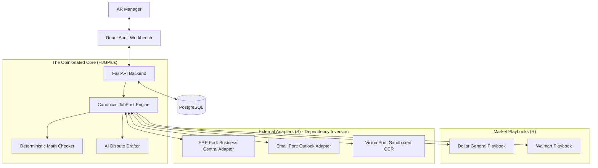

# HighGrowthJobs High-Level Architecture

*This document serves as the master **Directive Blueprint** for the HighGrowthJobs platform. It defines the "Target State" and the strict technical laws (patterns, stack, boundaries) that all implementations MUST follow.*

> ⚠️ **Implementation Reality Check:** To see what has *actually* been built so far, refer to the **[Current Implementation State](./current_state.md)** document. Do not assume all components described here are active in the codebase.

## Architecture Documentation Index
*   **[Current Implementation State](./current_state.md):** The "You Are Here" map of the codebase.
*   **[High-Level Data Flow](./data_flow_diagram.md):** A Mermaid diagram showing the interaction between external inputs (Adapters), the Core Engine, and the UI.
*   **[Data Model Overview (HTML)](./data_model/index.html):** A visual map of the entities, their relationships, and the Medallion architecture layers.
*   **[Full Entity Model (SQLModel Source Code)](../../src/data_model/models.py):** The technical source of truth for all database entities, types, and relationships.
*   **[Legacy Manual Process](./dispute_process_sequence.md):** A sequence diagram detailing the original, painful "swivel-chair" workflow used by Ashtel (The "As-Is" state).
*   **[HighGrowthJobs Opinionated Sequence](./high-growth-jobs_opinionated_sequence.md):** A sequence diagram showing how our new architecture collapses the legacy process into a streamlined "To-Be" state.
*   **[Orchestration & HITL Options](./submodules/orchestration_options.md):** A breakdown of technical patterns for managing the job-post lifecycle and human-in-the-loop interactions.
*   **[HJGPlus Orchestrator Submodule](./submodules/orchestrator.md):** Technical implementation path for the state machine and local event dispatcher.
*   **[HighGrowthJobs API Design Submodule](./submodules/api.md):** The RESTful API contract between the React Audit Workbench and the FastAPI Core (Updated to reflect the UI prototype's data structures, including computed statuses and line items).
*   **[HighGrowthJobs Frontend Architecture Submodule](./submodules/frontend.md):** The technical design of the Audit Workbench UI (React/TS/Tailwind).
*   **[HighGrowthJobs Identity & IAM Submodule](./submodules/identity.md):** The multi-tenant RBAC, authentication, and user-tenant mapping logic.
*   **[HighGrowthJobs Operational Observability](./submodules/operations.md):** Background job tracking, system health, and production monitoring.
*   **Strategic Decisions & Options:**
    *   [Executive Summary: The C x R x S Triad](./architecture_options/executive_summary.md) (Non-technical overview of our architectural constraints).
    *   [Why we chose the Hexagonal Core](./architecture_options/overview.md) (Detailed breakdown of the 4 architectural options considered and rejected).

---

## 1. System Overview (The Hexagonal Core)
HighGrowthJobs employs a **Hexagonal Architecture (Ports and Adapters)** to manage the $C \times R \times S$ (Customer, Market, Systems) complexity triad.

The philosophy is simple: **An Opinionated Core with Flexible Edges.**
*   **The Core:** We reject custom business logic (C). The system enforces a rigid, standardized "HighGrowthJobs Workflow" (Ingest -> Math Check -> Gather Evidence -> Human Review -> Submit).
*   **The Edges:** We provide ultimate flexibility by pushing all external integrations (Systems) and adversarial logic (Market Rules) to the perimeter as swappable Adapters and Playbooks.



## 2. Backend Architecture (Python/FastAPI)
Focus: Type safety, modularity, and explicit data contracts.

- **Framework:** **FastAPI** for high performance and native Pydantic support.
- **Dependency Management:** **uv** is the mandatory tool for all Python package management. It ensures sub-second environment synchronization and reproducible builds.
- **Directory Structure (Hexagonal Vertical Slices):**
  ```text
  src/
  └── app/
      ├── core/            # App-wide config, logging, telemetry, dependencies
      ├── domain/          # Pure Python business logic (Math, Lumping)
      ├── api/             # FastAPI Routers and DTOs (v1, v2)
      ├── ports/           # ABSTRACT definitions for external systems (SOLID)
      └── adapters/        # IMPLEMENTATIONS of Systems (S)
  ```
- **Database Interaction:** **SQLModel** (by the creator of FastAPI).
  - **Source of Truth:** All entities are defined in [`src/data_model/models.py`](../../src/data_model/models.py).
  - *Philosophy:* We use it primarily for schema definition and simple CRUD. For complex reporting or bulk reconciliation logic, we strictly utilize its `session.exec(text("RAW SQL"))` capability to avoid ORM state-management nightmares and "N+1" query performance issues. We want the safety of type-hinting without the opacity of a heavy ORM.
  - **Migrations:** **Alembic** (natively supported by SQLModel).
- **Data Validation:** **Pydantic v2** for all incoming payloads and outgoing responses.
- **Background Tasks:** Use FastAPI's `BackgroundTasks` for simple async logic. Given the decision to avoid heavy "Workflow-as-Code" engines, we rely on standard Postgres state tracking (polling) rather than Temporal/Airflow.

## 3. Frontend Architecture (React/TypeScript)
Focus: Performance at scale, financial data integrity, and "GrowthUI" brand alignment.

- **Framework:** **React 18 (LTS)** via **Vite 8 (Beta)**.
- **Validation Law:** All data crossing the network boundary (Request/Response/Errors) MUST be validated via **Zod**. We do not trust backend types at runtime.
- **State & Logic:** 
    - **Server State:** **TanStack Query (React Query) v5** is the mandatory standard for all data fetching. `useEffect` for fetching is strictly prohibited.
    - **Forms & Validation:** **React Hook Form + Zod** for strict, schema-based financial data entry.
    - **Virtualization:** **TanStack Virtual** for high-performance rendering of 100+ row remittance tables.
- **Styling:** **Tailwind CSS 4.2** + **shadcn/ui**. All UI aligns with the **GrowthUI** high-contrast professional palette (Primary: `#10B981`, Sidebar: `#020617`).
- **Data & Navigation Patterns:**
    - **Feature-Sliced Architecture:** Modular vertical slices (JobPosts, Remittances, Dashboard) with strict barrel boundaries.
    - **URL-as-State:** All filters and active tabs are persisted in the URL for deep-linking and persistence.
    - **Skeleton Screens:** Standardized loading states to reduce perceived latency.

## 4. Automated Testing Strategy
Quality is enforced at the local level to ensure `docker-compose up` always results in a stable environment.

- **Backend (Pytest):**
  - **Unit Tests:** Business logic in vertical slices.
  - **Integration Tests:** Endpoint testing using `TestClient` and a real (containerized) Postgres database.
  - **Mocking:** External adapters (ERPs, Portals) MUST be mocked using dependency injection during test runs.
- **Frontend (Vitest & Playwright):**
  - **Unit:** **Vitest** for helper functions and standalone component logic.
  - **E2E:** **Playwright** for the "Critical Path" (e.g., logging in, reviewing a job-post, and clicking 'Dispute').

## 5. CI/CD & Environment Strategy

HighGrowthJobs maintains strict separation between **Local Development** and **Production** while ensuring API parity.

- **Docker Performance Law:** To handle ARM64 (host) vs. Linux (container) native binding conflicts (e.g., `rolldown`, `psycopg`), `node_modules` and `.venv` MUST be managed via **Anonymous Docker Volumes**.
- **Environment Parity:** All environments use the same Docker-based service orchestration.
- **Local Flow:** `docker-compose up` runs Postgres, Redis, Minio (Local S3), FastAPI (reload mode), and Vite (dev mode).
- **Logical Multitenancy Fallback:** During development, logical multitenancy is enforced via the `X-Tenant-ID` header. In production, this MUST be extracted exclusively from verified JWT job-posts.
- **CI (GitHub Actions):** 
  - Run `ruff` (linting) and `mypy` (type checking) on every push.
  - Execute Backend and Frontend test suites.
- **CD (Hardened Hetzner VM):** 
  - Single-node deployment on a **Hetzner VM** (CPX11 or similar) using **Docker Compose**.
  - **SSH Hardening:** GitHub Actions uses a dedicated **non-root deploy user** restricted to `docker-compose` commands.
  - **Reverse Proxy:** **Caddy** (containerized) handles SSL/TLS (Automatic Let's Encrypt).
  - Deployment triggered via GitHub Actions using SSH to run `docker-compose pull && docker-compose up -d`.

## 6. Key Architectural Patterns

- **Dependency Inversion (DI) & Storage Abstraction:** 
    - Core logic NEVER interacts with a specific storage provider. 
    - It uses an `IStoragePort` (Abstract Base Class).
    - **Adapters:** 
        - `S3StorageAdapter`: Used for both Minio (Local) and Hetzner Object Storage (Prod), distinguished only by `.env` credentials.
        - `LocalStorageAdapter`: Optional, for testing without S3.

- **Hexagonal Vertical Slices:**
    - **Ports:** `erp.py` (IERPAdapter), `email.py` (IEmailAdapter).
    - **Adapters:** `erp_bc.py` (Business Central), `email_ms.py` (Outlook).

- **Process Orchestration (State Machine + "The Janitor"):** 
    - **Logic:** We use an explicit Python-based state machine to manage the job-post lifecycle (e.g., `NEW` -> `PROCESSING` -> `WON`). This prevents invalid state transitions.
    - **Execution:** A background **"Janitor" Process** (polling-based) monitors the database. When a job-post enters an actionable state (e.g., `READY_FOR_SUBMISSION`), the Janitor triggers the appropriate Market Playbook or Outbound Adapter.
    - **Human-in-the-Loop (HITL):** The Audit Workbench UI is an **Actor** that triggers state transitions. The UI only displays actions (like "Approve") that are valid for the job-post's current state.

- **The Medallion Data Strategy (Bronze-Silver-Gold):** To handle the "messy" nature of AI-native BPO operations, we apply Medallion principles within our relational database:
    1. **Bronze (The Raw Ledger):**
        - *Binary Pointer:* Original PDFs/ZIPs/Emails are stored in **S3-Compatible Object Storage**. The DB stores a `file_url`.
        - *Textual Trace:* Raw AI/OCR output and raw JSON from ERP APIs are stored in the DB's `metadata` JSONB columns. We never lose the original context.
    2. **Silver (The Canonical Core):**
        - Extracted, cleaned, and typed data lives in structured tables (`JobPost`, `Invoice`, `PurchaseOrder`).
        - Financials are stored in `Decimal` format with fixed precision.
        - Quantities are reconciled via standard Units of Measure (UoM).
    3. **Gold (The Decision Engine):**
        - The `Verdict` entity stores final actionable conclusions, human-readable reasoning, and AI confidence scores.
        - High-level business metrics (Recovery Rate, ROI) are calculated from this layer.

- **Stateless Artifacts:** All physical evidence (PDFs/Images) MUST be stored in **S3-compatible Object Storage** immediately upon ingestion. The VM filesystem is strictly ephemeral. The application code interacts only with the S3 API, ensuring it can run on any provider (Hetzner, AWS, etc.).

- **Logical Multitenancy (Day 1):** To avoid a nightmare migration later, every table MUST include a **tenant_id** (UUID).
    - **Propagation Strategy:**
        1. **Auth Layer:** `tenant_id` is embedded in the JWT job-post.
        2. **API Middleware:** Extracts `tenant_id` and injects it into a request context (FastAPI Dependency).
        3. **Logic Layer:** All service calls must receive the `tenant_id` to ensure business logic is scoped.
        4. **Data Layer:** Every query MUST include a `WHERE tenant_id = :current_tenant_id` filter (using SQLAlchemy's global filters or Repository pattern).
        5. **Storage Layer:** All artifacts in Object Storage are prefixed by tenant: `s3://bucket/{tenant_id}/artifacts/{file_id}`.
- **Auditability:** Every DB entry for a job-post must store the `OCR_confidence` and the `source_snippet_url` to justify the AI insight.

## 7. Security Architecture & Guardrails
- **Authentication:** **JWT-based** authentication using `python-jose`.
- **Inbound Data Guardrails (The Sandbox):**
    - **PDF/OCR Sandboxing:** All external document parsing (PyMuPDF/OCR) is performed in an isolated, non-networked container to prevent "Malicious PDF" exploits.
    - **LLM Scoping:** AI agents have **Zero** direct access to write to the Database or ERP. They produce "Verdict Proposals" which must be committed by a hardened internal controller.
- **Log Protection:**
    - **PII Redaction:** A custom **Logging Middleware** filters sensitive patterns (Bank Accounts, SSNs, Emails) before shipping to **Sentry** or **Slack**.
- **Supply Chain Security (Cost-Free):**
    - **Dependency Pinning:** Strict use of `poetry.lock` and `package-lock.json`.
    - **Automated Scanning:** Use **GitHub Dependency Review** and **Trivy (Open Source)** in CI.
- **Integration Security (ERP/Portal):**
    - **Principle of Least Privilege (PoLP):** ERP Service Users are restricted to `Read-Only` for Invoices and `Write-only` for specific Dispute Journal entries.
- **Observability:** 
    - **Error Tracking:** **Sentry** integration for both Backend and Frontend.
    - **Alerting:** **Slack/Discord Webhooks** for critical process failures.

## 8. Disaster Recovery & Reliability
Focus: Extreme cost-efficiency with "Data Durability" over "High Availability."

- **Primary Infrastructure:** Single Hetzner VM instance. 
- **Database Backups:**
    - **Frequency:** **Hourly** `pg_dump` backups.
    - **Offsite Storage:** Backups are encrypted and shipped to **Hetzner Object Storage** (using Bucket Versioning).
- **Recovery Strategy (The "Cold Swap"):**
    - If the Hetzner VM or Volume fails, a new VM is provisioned.
    - Environment re-established via `docker-compose up`.
    - Latest hourly backup is pulled from Object Storage and restored.
- **RTO/RPO Targets:**
    - **RPO:** 1 Hour (maximum data loss).
    - **RTO:** 1 Hour (automated provision and restore).
