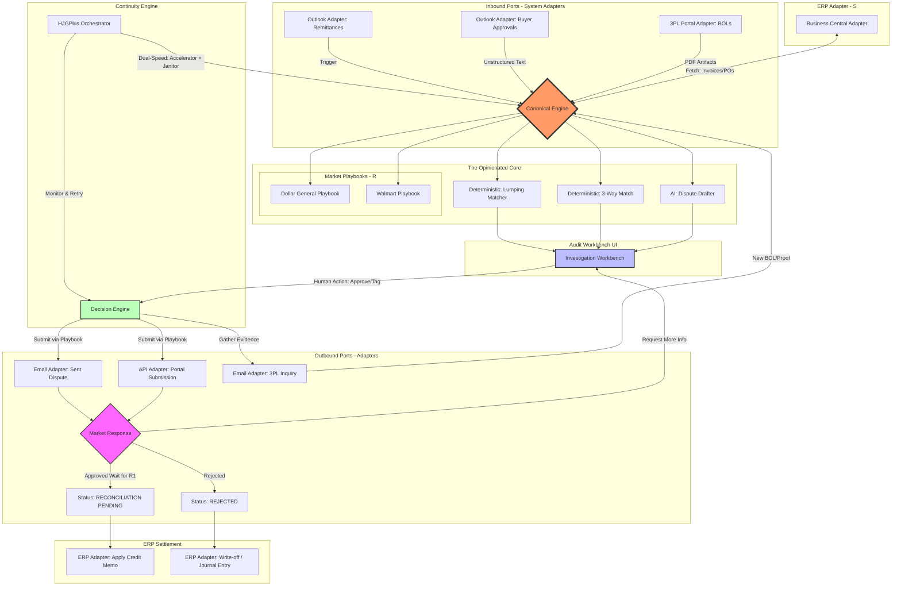

# HighGrowthJobs High-Level Data Flow

This diagram illustrates the "Email-to-Action" loop via our **Hexagonal Architecture**. It highlights how flexible System Adapters feed into the rigid, Opinionated Core.

### Flow Description:
1.  **Ingestion (S):** The process is triggered via the **Outlook Adapter** capturing a remittance ZIP or deduction email.
2.  **Contextualization (S):** The core requests Invoice/PO data through the **Business Central Adapter**.
3.  **Intelligence & Playbooks (Core + R):** 
    -   The core extracts canonical data using AI.
    -   The **Deterministic Math Engine** runs the Lumping Matcher.
    -   The specific **Market Playbook** (e.g., DG) dictates what evidence is required and how the dispute should be drafted.
4.  **Inquiry Loop:** If a BOL is missing, an adapter fetches it from the 3PL portal or emails the 3PL.
5.  **Verification (The Rigid 'C'):** The **Audit Workbench** presents the unified view. The human is forced to use our UI to hit "Approve," rejecting complex offline routing.
6.  **Resolution:** 
    -   **Won:** Awaits the "R1" code, then updates the ledger via the ERP Adapter.
    -   **Rejected:** Results in a final **Write-off** via the ERP Adapter.
