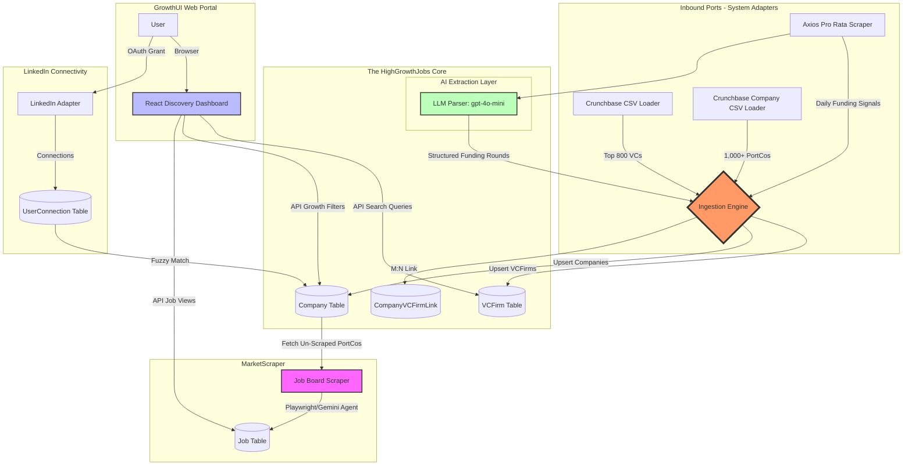

# HighGrowthJobs High-Level Data Flow

This diagram illustrates the daily "Signal-to-Discovery" loop via our **Hexagonal Architecture**. It highlights how external ingestion adapters feed into the canonical HighGrowthJobs tracking core.

### Flow Description:
1.  **Seed Ingestion (S):** The platform initialization is achieved by the **Crunchbase CSV Loaders**, seamlessly seeding hundreds of top VCs and linking them to thousands of high-growth companies.
2.  **Daily Signal Ingestion (S):** Fast-moving updates (like new Series A rounds) are ingested by the **Axios Pro Rata Scraper** via headless HTTP/Markdown paths.
3.  **AI Extraction & Routing (Core):** 
    -   The `gpt-4o-mini` adapter ensures unstructured newsletter text becomes normalized database structures.
    -   The core performs aggressive upserts (merging existing DB entries, and handling missing VCFirms via the `is_stub=True` logic).
4.  **Job Scraping Loop (MarketScraper):** Once companies are canonicalized, the scraping service navigates their career pages to harvest active `Job` listings.
5.  **GrowthUI Discovery:** Users enter the system through the React frontend, querying the highly structured data by specific growth constraints ("Show me remote PM roles at Series A companies funded by Founders Fund").
6.  **Network Intelligence (Epic 5):** The user seamlessly connects their LinkedIn to find 1st-degree referrals inside the curated database.
